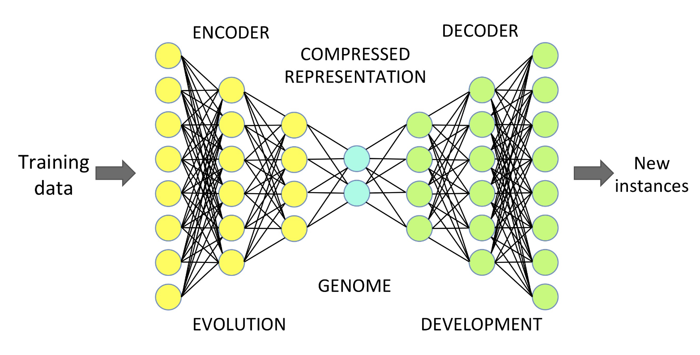
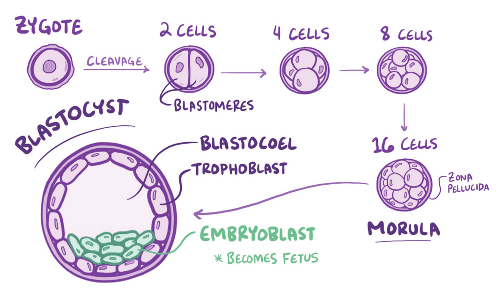
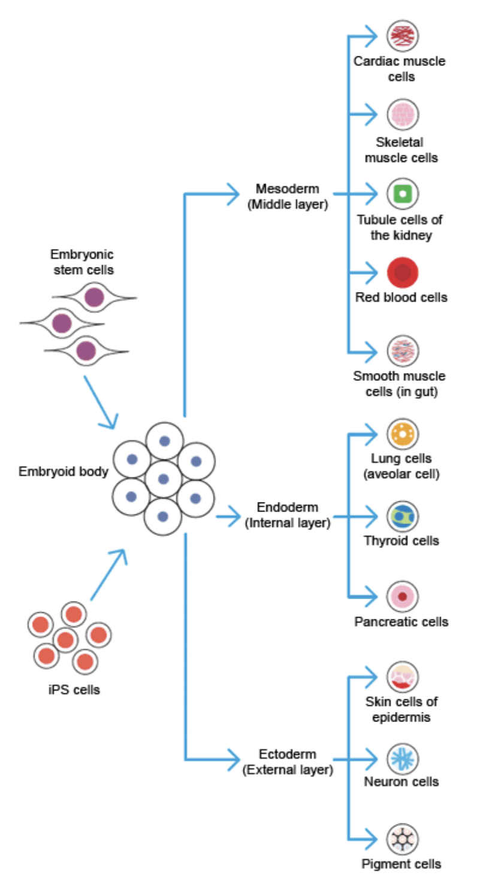
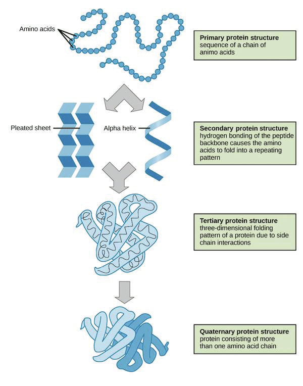
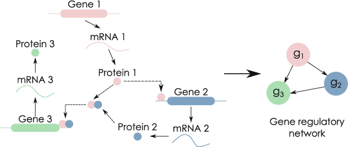
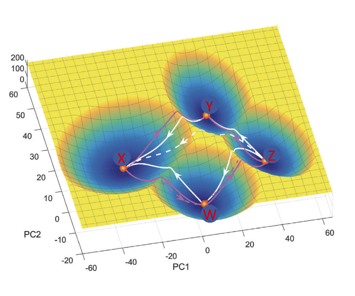
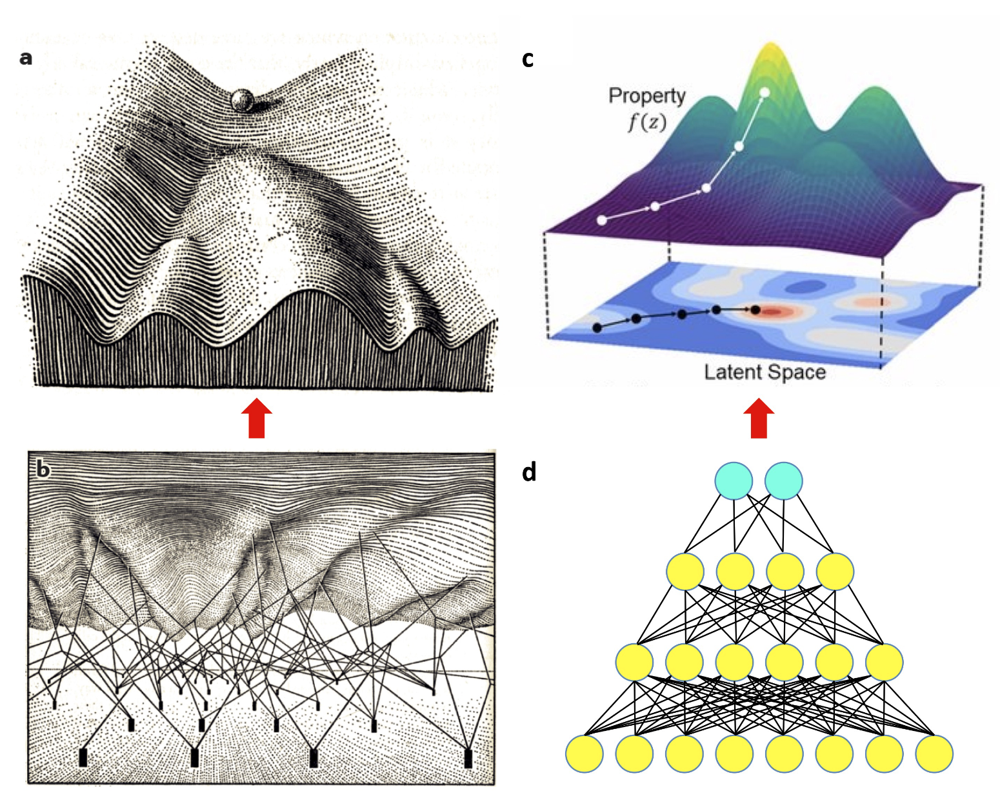
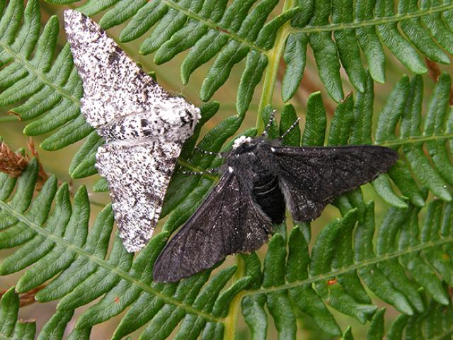
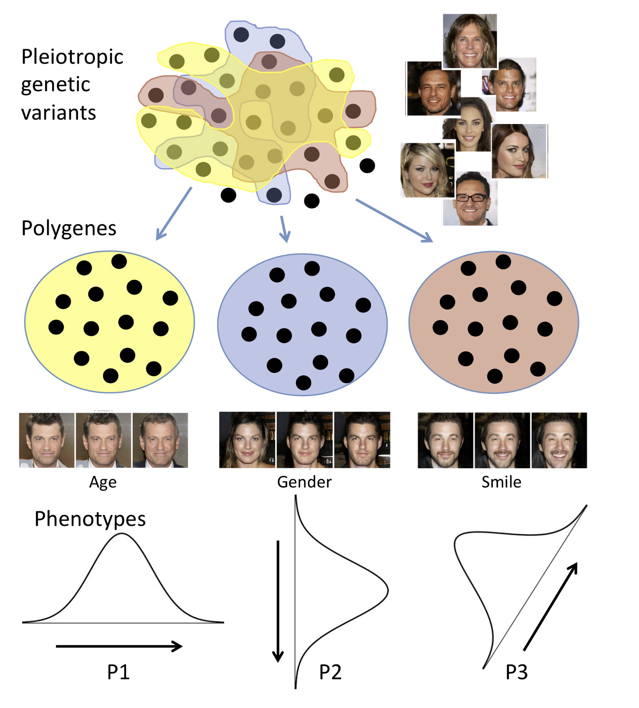

<!-- NOTE: LEAVE THIS SLIDE AS-IS -->
<!-- _class: lead -->
<!-- _footer: '' -->
<!-- _paginate: false -->
<!-- _backgroundColor: #000 -->
<!-- _backgroundImage: url('./media/slide_bg_dark.png') -->
<!-- NOTE: `scoped` is used to limit the styles to the current slide -->

<!-- Title -->
<h1> Subhankar Mishra Lab Weekly Talks </h1>

<!-- Socials -->

<!-- Lab-talks website -->
  
  <!-- Lab-talks GitHub -->
  
  <!-- Lab Twitter -->
  
  <!-- Lab public email -->
  

<!-- Logos -->

  
  
  
  

---
<!-- NOTE: A `_` prefix is used to change properties for only the current slide -->

<!-- _class: lead -->
<!-- _footer: '' -->
<!-- _paginate: false -->
<!-- _backgroundColor: #000 -->
<!-- _backgroundImage: url('./media/slide_bg_dark.png') -->
<!--  -->
<!-- NOTE: Multiple images added here - one in BG, one in FG -->
<!-- 
# **Title Slide Variation 1**

  Shithij

  Subhankar Mishra Lab 
  Sep , 2024

--- -->
<!-- NOTE: Another example of title slide -->

<!-- _class: lead -->
<!-- _footer: '' -->
<!-- _paginate: false -->
<!-- _backgroundColor: #000 -->
<!-- _backgroundImage: url('./media/slide_bg_dark.png') -->
  

# **The Genomic Code**
## The genome instantiates a generative model of the organism

  Shithij T

  Subhankar Mishra Lab 
  Sep 9, 2024

---

# What is Genomic Code

We usually use some metaphors for capturing the notion of genomic code: 

- Blueprint
- Program
- Recipe
- Resource

---

# What is Genomic Code

The current metaphors fail to provide any insights on these crucial questions:

- How does information get encoded in the genome and what is this information about?
- What is the “data format” of this information in the genome?
- How does such information get decoded through the processes of development?
- How does genotypic variation relate to phenotypic variation?
- How does the genetic architecture of various traits arise?
- How do the underlying encodings evolve through time?

---

# Generative model

The genome instantiates a generative model of the organism

- An encoding of latent variables
- A mean of decoding them

---

# Generative model

---

# The Latent Variable

The latent variable of the genome are the the DNA nucleotides themselves, which, over sequences of varying length: 

- Encode RNA and protein molecules that do the work in the cellular economy, including the regulation of gene expression
- Comprise binding sites for regulatory factors

With respect to the form of the organism, these variables are “latent” because the relationship of the genomic sequence to the form of the organism is distributed, non-linear, and extremely indirect.

---

# The Decoder

- The cells of the developing embryo take the compressed information encoded in the genome and use it to build a fully formed organism.

- Unlike the regular machine learning models, these models have to build their own decoders along the way.

---

# The Decoder

- Initial Conditions
- Cell differentiation and division
- Temporal and Spatial Coordination
- Self Organisation

---

# Initial Condition

- The genetic code is packaged into chromatin, making some part of it inaccessible (Changes the landscape of latent variable)
- Zygote inherits some nuclear, cytoplasmic and membrane proteins - the elements that actively do the decoding

---

# Cell division and differentiation

- With each division, the initial conditions and the configuration of the decoder change.
- This determines which elements of the generative model will be active in any newly generated cell, allowing the decoder to generate the appropriate cell type.

---

# Spatial and Temporal Coordination

- All the cellular differentiation has to be spatially and temporally coordinated.
- Generative model encoded in the genome must also direct processes like proliferation, differentiation, cell signaling, and morphogenetic movements to ensure the emergence of the three-dimensional form of the organism.

---

# Self-Organisation

- While the genome provides a set of constraints, it does not encode all the physical parameters and self-organizing dynamics required for development.
- The genome only needs to encode constraints that channel these processes along specific trajectories

---

# Gene Regulatory Network

<!-- NOTE: Setting a background image of a particular width and height -->

---

# Gene Regulatory Network

- Gene regulatory networks are complex systems where genes interact with each other to control various biological processes, particularly development.

- These networks can be understood as graphs where genes are nodes, and the edges represent the regulatory interactions between them, either activating or repressing each other

- The regulatory elements of a gene can be seen as performing logical operations based on the signals received from other regulators.

- However, unlike simple logic gates, genes operate in a more graded, probabilistic, and dynamic fashion within this interconnected network.

---

# Attractor States

- Attractor states emerge from the dynamic nature of gene regulatory networks.

- Instead of settling into a single static state, these networks can tend towards multiple stable states called attractor states.

- Visualize this as a ball rolling down a bumpy hill, eventually settling into one of several valleys. Each valley represents a stable attractor state

---

# Energy Landscapes

- Waddington's epigenetic landscape is a foundational concept in developmental biology
- He represented cells as balls traversing this landscape during development.
- The landscape itself, with its valleys and ridges, is shaped by the collective influence of the genome, influencing which cell fates are more likely

<!-- NOTE: Setting a background image of a particular width and height -->

---

# The Encoder

- Evolution functions as a learning algorithm, similar to those used in machine learning.
- Natural selection plays a crucial role in shaping this generative model over time. Variations arise in the genome, leading to phenotypic differences among organisms.
- Those with traits better suited to the environment have higher reproductive success, increasing the frequency of their genes in the next generation

---

# Properties of Generative model

1. Compression through a bottleneck layer.
2. Encoding in a latent variable space.
3. Abstract, indirect representations.
4. Intrinsic variability of outputs.
5. Robustness.
6. Evolvability.

---

# Properties are interrelated

- Compression enforces the abstraction and encoding of latent variables.
- Alteration of individual latent variables is often tolerated by the system, which gives rise to robustness.
- The noise is not simply a flaw; it's an integral part of the system that enables robustness and evolvability.
- Paradoxically, robustness leads to evolvability.

---

# Emergent modularity, Disentangled representations

---

# Future Prospects

- Revolutionizing Developmental Biology Research
  - Moving Beyond Reductionism
  - Formalizing Waddington's Landscape
  - Leveraging Deep Learning
- Advancing the Field of Artificial Life
  - More Realistic Encoding Schemes
  - Harnessing Machine Learning for ALife
- Deeper Understanding of Evolution and Genetic Architecture
  - Explaining Complex Trait Evolution
  - Predicting Evolutionary Trajectories
---

# References 

1. Mitchell, Kevin J., and Nick Cheney. "The Genomic Code: The genome instantiates a generative model of the organism." arXiv preprint arXiv:2407.15908 (2024).

---

<!-- _paginate: false -->
<!-- _footer: '' -->

# _Questions?_
